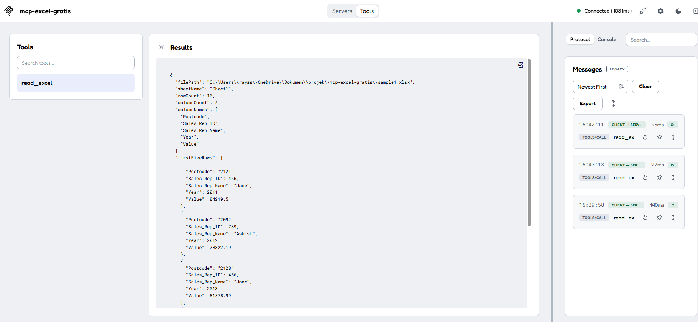

# mcp-excel

MCP server untuk baca file Excel (.xlsx, .xls). Gratis, open source, tanpa API key.

## Features

- Baca file Excel (.xlsx, .xls)
- Tampilkan jumlah baris & kolom
- Tampilkan nama-nama kolom
- Tampilkan 5 baris pertama sebagai preview
- Error handling yang clean

## Install

```bash
git clone https://github.com/username/mcp-excel-reader.git
cd mcp-excel-reader
npm install
npm run build
```

## Usage

### Jalankan Server

```bash
npm start
```

### Test dengan MCP Inspector

```bash
npx @modelcontextprotocol/inspector
```

Buka browser ke `http://localhost:6274`, lalu connect:

- **Command:** `node`
- **Arguments:** `dist/server.js`
- **Working Directory:** `/path/to/mcp-excel-gratis`

### Konfigurasi di Claude Desktop

Tambahkan di `claude_desktop_config.json`:

```json
{
  "mcpServers": {
    "mcp-excel-gratis": {
      "command": "node",
      "args": ["/path/to/mcp-excel-gratis/dist/server.js"]
    }
  }
}
```

## Tool: `read_excel`

**Input:**

| Parameter | Type | Description |
|-----------|------|-------------|
| `filePath` | string | Path lengkap ke file Excel |

**Output:**

```json
{
  "filePath": "/path/to/file.xlsx",
  "sheetName": "Sheet1",
  "rowCount": 100,
  "columnCount": 5,
  "columnNames": ["Name", "Email", "Phone", "City", "Value"],
  "firstFiveRows": [
    {
      "Name": "John Doe",
      "Email": "john@example.com",
      "Phone": "08123456789",
      "City": "Jakarta",
      "Value": 1500000
    }
  ]
}
```

## Demo

The MCP server successfully reads Excel workbook data through the `read_excel` tool.




## Tech Stack

- TypeScript
- [Model Context Protocol SDK](https://github.com/modelcontextprotocol/typescript-sdk)
- [SheetJS (xlsx)](https://www.sheetjs.com/)

## License

MIT
